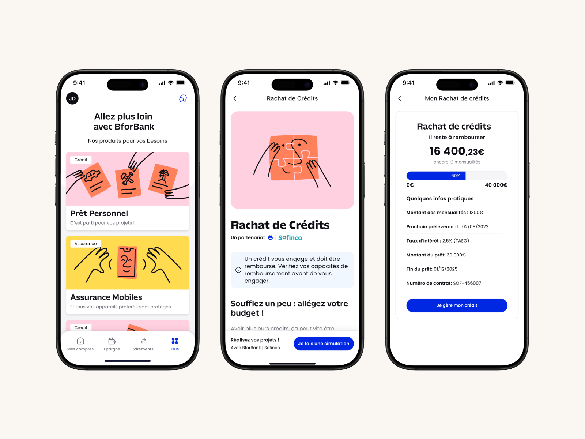

# Juan Estupinan

**Product Design & UX Lead · 15+ years crafting digital products**

Paris, France · Working with clients worldwide

[focuswave.io](https://focuswave.io/) · [LinkedIn](https://linkedin.com/in/juanestupinan) · [YouTube](https://youtube.com/@juanestupinan_design) · [Instagram](https://instagram.com/juanestupinan_design)

---

## About

Product Design & UX Lead with 15+ years designing and shipping digital products.

Before founding **Focuswave** in 2017, I served as **Head of Mobile at Condé Nast**, where I led the launch of 20+ apps for brands like *Vogue*, *GQ*, and *Vanity Fair*. I also co-founded [**Wigoo.com**](http://wigoo.com/), an early no-code platform for building mobile apps, and taught Mobile Design & UX at **Gobelins** in Paris.

Today I help companies turn ideas into products that balance user needs and business goals—combining:

- Design leadership
- User experience
- Product design
- Webflow development
- AI-assisted workflows

**My current focus:** AI micro-apps and how design and code are converging into a unified workflow.

---

## AI Micro-Apps

I use AI coding agents (Claude, Cursor) with React, Next.js, and Tailwind CSS to design and build compact applications that demonstrate real product craft.

### 🎮 Skills Explorer

Interactive word-search game that replaces a traditional CV.

- Built from scratch with no external game libraries
- Custom grid generation with word placement algorithm
- Canvas-based selection detection and hint animations
- Web Audio API synthesis that reacts to user actions
- Progress tracking with confetti celebrations

**Live:** [juan-skills-explorer.vercel.app](https://juan-skills-explorer.vercel.app/)  
→ Case study: [focuswave.io/skills-explorer](https://focuswave.io/skills-explorer)

---

### 🎨 Focus Paint

Drawing micro-app inspired by 90s MS Paint.

- Canvas-based whiteboard for quick sketching
- Built as an AI-assisted coding experiment exploring multi-agent workflows
- Playground for UI patterns, tools, and micro-interactions

**Live:** [focuspaint.vercel.app](https://focuspaint.vercel.app/)  
→ Case study: [focuswave.io/focus-paint](https://focuswave.io/focus-paint)

---

## Selected Client Work

Some of the products I've designed and shipped as a consultant:

### BforBank – Financial Product Marketplace

Designed a marketplace inside the banking app so users can explore and activate credits, savings, and insurance with clarity and confidence.

→ Case study: [focuswave.io/bforbank](https://focuswave.io/bforbank)

---

### Le Parisien – News App Redesign

Led the UX redesign of Le Parisien's mobile app, turning it into a modern news experience that increased engagement.

→ Case study: [focuswave.io/leparisien](https://focuswave.io/leparisien)

---

### Condé Nast – Digital Publishing Framework

As Head of Mobile, led the shift from print to mobile with a reusable app framework powering 20+ mobile apps.

→ Case study: [focuswave.io/condenast](https://focuswave.io/condenast)

---

### Breathonance – E-learning Platform

Designed and built a complete Webflow platform with Stripe payments and Kajabi integration for online breathwork courses.

**Live:** [breathonance.com](https://breathonance.com/)  
→ Case study: [focuswave.io/breathonance](https://focuswave.io/breathonance)

---

### PranayamaRx – Medical-grade Website

Webflow site for a Harvard-affiliated pulmonologist, explaining pranayama from a medical perspective.

**Live:** [pranayamarx.com](https://pranayamarx.com/)  
→ Case study: [focuswave.io/pranayamarx](https://focuswave.io/pranayamarx)

---

### React & Share – SaaS Marketing Website

Webflow implementation of a SaaS marketing site with CMS blog and demo booking flow.

**Live:** [reactandshare.com](https://reactandshare.com/)  
→ Case study: [focuswave.io/reactandshare](https://focuswave.io/reactandshare)

---

**More projects** → [focuswave.io/projects](https://focuswave.io/projects)

---

## Tools & Stack

### Design & Code Convergence

Working with AI coding agents to unify design and development into a single workflow.

**Design**

Figma · Design Systems · Prototyping · User Research · Information Architecture

**Development**

React · Next.js · TypeScript · Tailwind CSS · Webflow

**AI Workflows**

Claude · Cursor · OpenAI · V0

---

## Work With Me

If you need design leadership or someone who can **think, design, and build** your next product:

🌐 [focuswave.io](https://focuswave.io/)  
📧 [juan@focuswave.io](mailto:juan@focuswave.io)  
👔 [linkedin.com/in/juanestupinan](https://linkedin.com/in/juanestupinan)  
📹 [youtube.com/@juanestupinan_design](https://youtube.com/@juanestupinan_design)
